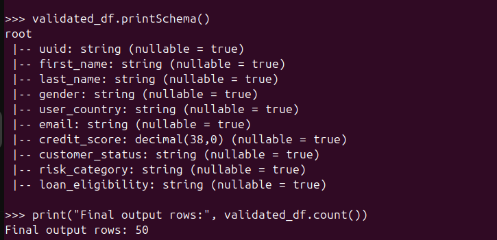

# AWS EMR + PySpark + Snowflake ETL Pipeline with Airflow Orchestration

## Project Overview

This project demonstrates an end-to-end cloud-based Data Engineering pipeline built using AWS EMR, PySpark, Amazon S3, Snowflake, and Apache Airflow.

The pipeline ingests raw JSON data from the Random User API, performs distributed data transformations using PySpark on AWS EMR, stores intermediate and final datasets in Amazon S3, integrates with Snowflake for business-layer processing, and orchestrates the entire workflow using Apache Airflow.

This project was designed to simulate a real-world production ETL workflow commonly used in modern Big Data and Cloud Data Engineering environments.

---

# Architecture

```text
Random User API
        ↓
Raw JSON Data
        ↓
Amazon S3 (Raw Layer)
        ↓
AWS EMR Cluster
        ↓
PySpark Transformations
        ↓
Flattened Parquet File (File 1)
        ↓
Business Dataset Generation
        ↓
Snowflake Integration (File 2)
        ↓
Business Logic Processing
        ↓
Amazon S3 Processed Layer
        ↓
Final Join Transformation
        ↓
Final Curated Output in S3
        ↓
Apache Airflow Orchestration
```

---

# Technologies Used

## Cloud Services
- AWS EMR
- Amazon S3
- AWS IAM

## Big Data Technologies
- Apache Spark
- PySpark
- Spark SQL

## Data Warehouse
- Snowflake

## Workflow Orchestration
- Apache Airflow

## Programming & Tools
- Python
- AWS CLI
- Git
- GitHub Actions
- Linux / Ubuntu

---

# Key Features

- End-to-end ETL pipeline implementation
- Distributed PySpark processing on AWS EMR
- JSON flattening and schema normalization
- Parquet-based optimized storage
- Snowflake integration using Spark connector
- Business-layer transformation logic
- Automated Airflow orchestration
- Final dataset validation and curated output generation
- GitHub CI/CD workflow integration

---

# Pipeline Workflow

## Step 1 — API Data Extraction
- Extracted user data from Random User API
- Stored raw JSON data into Amazon S3

## Step 2 — EMR PySpark Processing
- Created AWS EMR cluster
- Read JSON data using PySpark
- Flattened nested structures
- Resolved duplicate column conflicts
- Generated File 1 in Parquet format

## Step 3 — Snowflake Integration
- Generated business-layer dataset (File 2)
- Added:
  - credit_score
  - customer_status
  - risk_category
  - loan_eligibility
- Loaded File 2 into Snowflake

## Step 4 — Final Data Processing
- Read Snowflake data back into Spark
- Applied business transformations
- Joined File 1 and File 2
- Wrote final curated dataset to Amazon S3

## Step 5 — Airflow Orchestration
Apache Airflow DAG automates the complete workflow:

```text
Create EMR Cluster
        ↓
Run PySpark ETL Step 1
        ↓
Run PySpark ETL Step 2
        ↓
Run PySpark ETL Step 3
        ↓
Run Final Join Step
        ↓
Monitor EMR Steps
        ↓
Terminate EMR Cluster
```

---

# Airflow DAG Features

- Automated EMR cluster creation
- Automated Spark job submission
- EMR step monitoring using sensors
- Automatic EMR cluster termination
- Retry and failure handling
- Production-style orchestration workflow

---

# Project Structure

```text
aws-emr-snowflake-etl-pipeline/
│
├── dags/
│   └── emr_snowflake_airflow_dag.py
│
├── src/
│   ├── 01_api_to_s3_file1.py
│   ├── 02_generate_file2_to_snowflake.py
│   ├── 03_snowflake_to_s3_file2.py
│   └── 04_join_file1_file2_final.py
│
├── config/
│   └── config_template.py
│
├── docs/
│   └── architecture.md
│
├── screenshots/
│
├── .github/workflows/
│   └── ci.yml
│
├── requirements.txt
├── airflow_requirements.txt
├── README.md
└── .gitignore
```

---

# Final Output Validation

The final curated dataset was validated successfully after the complete ETL workflow execution.

Example validations performed:
- Row count validation
- Schema validation
- Final joined output verification
- S3 Parquet validation

---

# Screenshots

## Final Output Validation

```markdown

```

---

# Future Enhancements

- Dockerized Airflow deployment
- MWAA (Managed Airflow) deployment
- Terraform infrastructure automation
- Real-time streaming with Kafka
- Delta Lake integration
- CI/CD deployment automation
- Data quality checks using Great Expectations

---

# Learning Outcomes

Through this project, I gained hands-on experience with:

- Distributed data processing using PySpark
- AWS EMR cluster management
- Cloud-based ETL pipeline design
- Snowflake integration
- Workflow orchestration using Apache Airflow
- S3 data lake architecture
- GitHub-based version control and CI/CD workflows
- Real-world Data Engineering workflow implementation

---

# Author

Dijo Padamadan

Aspiring Data Engineer | PySpark | AWS | Snowflake | Airflow | SQL | Python
